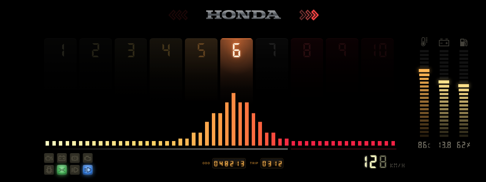

# honda-retro

A retro Honda-inspired cluster for the Ghost Dashboard: 7-segment digits, a
bar-wave tachometer and backlit warning lights on a pure black canvas.



## Features

- **Tachometer**: a wave of 53 bars that follows the RPM, rising fast and
  falling with some weight, and sending pulses back along its tail while you
  accelerate. One cell per 1000 RPM lights up as you pass it, with a fading
  trail. The red zone starts at 8000 RPM and adapts to the RPM max setting.
- **Speed**: three 7-segment digits with ghosted leading zeros and a glow
  whose color goes from white to cream, orange, red and pink-red as you go
  faster.
- **Red-line glow**: the edges of the screen redden from 7000 RPM, spread in
  toward the center up to 9000, and pulse like a shift light near the cut-off.
- **Gauges**: coolant temperature (cold blue to hot red, icon lights red from
  100 °C), battery and fuel (empty-to-full color ramp, pump icon pulses below
  20%). On the left, lambda (rich blue to lean orange, with a RICA / OK /
  POBRE label) and oil pressure in bar. Both hold their worst reading for a
  couple of seconds and turn red on a lean mixture under load or low oil
  pressure. Gauges in their normal range are slightly dimmed, so the one that
  needs attention stands out.
- **Warning lights**: oil pressure, battery, handbrake, check engine, open
  door, park lights, fog lights and high beam, each drawn as a backlit lens
  that warms up when it switches on.
- **Turn signals**: sequential, Mustang-style chevrons either side of the
  chrome HONDA logo.
- **Odometer**: golden roller drums for the total (6 digits) and the trip
  (4 digits), kept dim as reference info.

## Data and settings

- RPM, speed and coolant follow the CAN/Basic source settings; battery,
  lambda, oil pressure and throttle (TPS) come from CAN; fuel, warning lights
  and turn signals come from the Basic module.
- The tachometer uses the **RPM max** setting (6000–10000) for its number of
  cells, and 10000 when it's not set. The design is drawn for 10000.
- The oil pressure gauge's full scale is the **pOil** setting (10 bar if not
  set).
- The odometer uses the SDK's `loadOdo` / `updateOdo`, so totals, trip reset
  and the base km setting work as in the other skins.

## Fonts and assets

- **Digital Numbers** by Stephan Ahlf, SIL Open Font License 1.1
  (`fonts/OFL.txt`). It ships with the skin because it is not in the SDK.
- Warning-light icons come from the SDK (`../../assets/icons`); the oil, gauge
  and HONDA logo icons are exported from the design and live in `icons/`.

## Development

The skin is built with Vite from `src/` (one component per part) into a
single `script.js` that loads like any other skin.

```bash
npm install
npm run dev     # opens _dev.html with simulated data
npm run build   # writes script.js next to index.html
```

`script.js` is committed, so the skin runs from the devkit without building.
